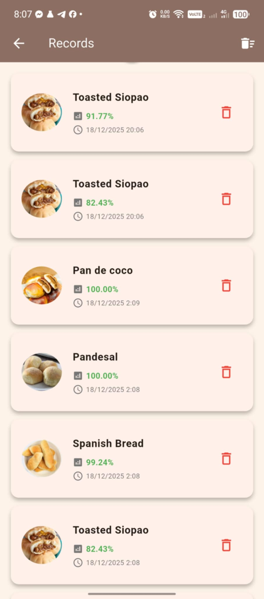
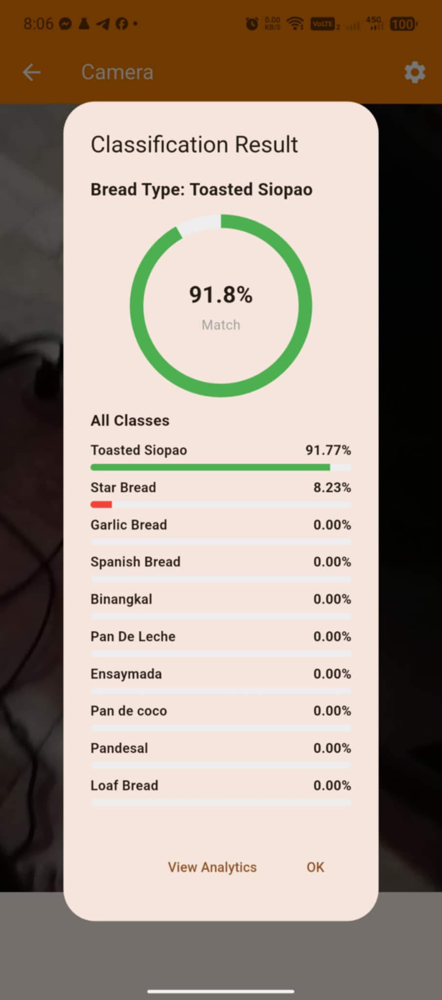
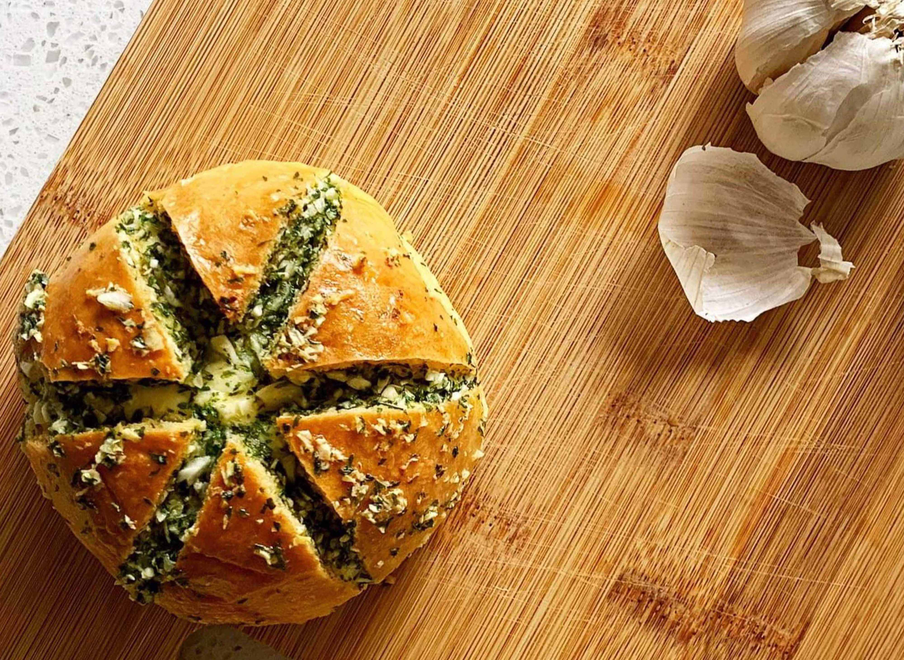

  

  

  

---

## 🎓 About Me

class StudentDeveloper:
    def __init__(self):
        self.name = "Nathaniel"
        self.focus = "Mobile & ML-powered apps"
        self.location = "Philippines"
        self.technologies = ["Flutter", "Dart", "Python", "TensorFlow Lite"]
    
    def say_hi(self):
        print("Thanks for visiting my GitHub! Let's build something awesome.")

me = StudentDeveloper()
me.say_hi()- 🧠 **Interests**: Mobile development, machine learning, and clean UI  
- 📱 **Main project**: Bread Classifier App (Flutter + TensorFlow Lite)  
- 🌱 **Learning**: More advanced ML models and better app UX  

---

## 🛠️ Tech Stack

**Languages & Frameworks**

**Tools**

---

## 🍞 My Bread Classifier App

A Flutter mobile application that uses **TensorFlow Lite** to classify different types of bread from camera images.  
Screenshots are stored in [`App_Screenshot`](https://github.com/Nathaniel-uiii/Nathaniel-uiii/tree/main/App_Screenshot).

### 🏠 Main Page & 📊 Analytics

| **Main Page** | **Analytics** |
| ------------- | ------------- |
|  |  |

The **Main Page** lets users start a classification by opening the camera, viewing analytics, or checking their history.  
The **Analytics** screen shows how often each bread type has been detected and overall usage statistics.

---

### 📷 Camera, 📄 Records & ✅ Result

| **Camera** | **Records** | **Result** |
| ---------- | ----------- | ---------- |
|  |  |  |

- **Camera**: Capture a bread image or select one from the gallery.  
- **Records**: Browse your previous classifications with timestamps.  
- **Result**: View the predicted bread type along with confidence scores.

---

## 🥐 Bread Classes

Bread images are stored in [`My_Classes`](https://github.com/Nathaniel-uiii/Nathaniel-uiii/tree/main/My_Classes).  
These are the bread types the model can recognize.

<table>
  <tr>
    <td align="center">
       
      <b>Pan de Coco</b> 
      Soft bun filled with sweet coconut filling.
    </td>
    <td align="center">
       
      <b>Binangkal</b> 
      Deep-fried dough balls coated in toasted sesame seeds.
    </td>
    <td align="center">
       
      <b>Pandesal</b> 
      Classic Filipino breakfast roll with a light, soft crumb.
    </td>
    <td align="center">
       
      <b>Loaf Bread</b> 
      Standard sliced loaf, perfect for sandwiches and toast.
    </td>
    <td align="center">
       
      <b>Pan de Leche</b> 
      Milky, slightly sweet rolls with a soft, fluffy texture.
    </td>
  </tr>
  <tr>
    <td align="center">
       
      <b>Garlic Bread</b> 
      Bread flavored with garlic and butter, often toasted.
    </td>
    <td align="center">
       
      <b>Spanish Bread</b> 
      Rolled bread with a sweet, buttery filling.
    </td>
    <td align="center">
       
      <b>Star Bread</b> 
      Star-shaped soft bread, lightly sweet and fluffy.
    </td>
    <td align="center">
       
      <b>Ensaymada</b> 
      Soft, buttery pastry topped with cheese and sugar.
    </td>
    <td align="center">
       
      <b>Toasted Siopao</b> 
      Baked version of siopao with a savory meat filling.
    </td>
  </tr>
</table>
---

## 📊 GitHub Stats

<table>
  <tr>
    <td>
      
    </td>
    <td>
      
    </td>
  </tr>
</table>

---

## 🎯 Goals

- Improve the Bread Classifier model and UI  
- Build more ML-powered mobile apps  
- Contribute to open source Flutter and ML projects  

---

  <b>“Learning to code, one commit at a time.”</b>

